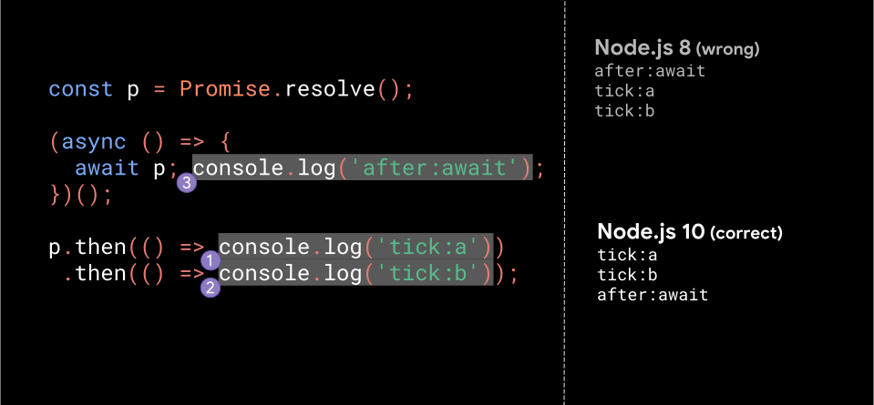

大概在去年的这个时候，V8 团队发布了一篇博文[Faster async functions and promises](https://v8.dev/blog/fast-async)，向我们介绍了他们是如何提升 await 的执行速度，值得一看，这里有[中文版](https://v8.js.cn/blog/fast-async/)。

文章中提到了在不同 Node 版本中，await 和 promise 执行时机不同的问题，如下：


>可以说，这种“正确的行为”其实并不直观，对 JavaScript 开发者来说实际上是令人惊讶的，所以值得做一些解释。

文章由浅入深讲解了 await 的底层原理和优化过程，说实话，看完我还是很懵逼。譬如，试着解答下面代码【PP】的执行顺序，以及为什么会这样？
````js
const p = Promise.resolve(42)

const asyncFn = (async function () {
  await p; 
  console.log('after:await', 1);
  await p;
  console.log('after:await', 2);
})();

asyncFn.then(() => console.log('after:asyncFn'))

Promise.resolve(p).then(() => console.log('tick:1'))
 .then(() => console.log('tick:2'))
 .then(() => console.log('tick:3'))
 .then(() => console.log('tick:4')) 
 .then(() => console.log('tick:5')) 
 .then(() => console.log('tick:6')) 
 .then(() => console.log('tick:7')) 
 .then(() => console.log('tick:8')) 
 .then(() => console.log('tick:9')) 
````
所以，今天我尝试结合 V8 团队的文章和 [ecma262 await](https://tc39.es/ecma262/#await) 规范，直白的说一下这个过程。Node 版本为 v10.16.3。

#### 规范 6.2.3.1Await
对于 `await (value)`，按以下规范实现：
1.   把 `asyncContext` 作为当前的执行上下文
2.   promise = PromiseResolve(%Promise%, value).
3.   定义 stepsFulfilled，它的执行步骤定义在 [Await Fulfilled Functions](https://tc39.es/ecma262/#await-fulfilled).
4.   onFulfilled = CreateBuiltinFunction(stepsFulfilled, « [[AsyncContext]] »).
5.   onFulfilled.[[AsyncContext]] = asyncContext.
6.   定义 stepsRejected，它的执行步骤定义在[Await Rejected Functions](https://tc39.es/ecma262/#await-rejected).
7.   onRejected = CreateBuiltinFunction(stepsRejected, « [[AsyncContext]] »).
8.   onRejected.[[AsyncContext]] = asyncContext.
9.   执行 PerformPromiseThen(promise, onFulfilled, onRejected).
10.  将 asyncContext 从执行上下文栈顶移除
11.  设置 asyncContext 代码的运行状态，以便在未来恢复运行后，await 之后的代码能够被完全执行。
12.  return 一个 promise

#### await 的 V8 表示
对于如下代码：
````js
async function foo(v) {
  const w = await v;
  return w;
}
````
V8 内部表示如下：
````js
resumable function foo(v) {
  implicit_promise = createPromise();

  // 将 v 包装成一个 promise
  promise = promiseResolve(v)

  // 为恢复 foo 函数添加处理器
  throwaway = createPromise();
  performPromiseThen(promise,
    res => resume(<<foo>>, res),
    err => throw(<<foo>>, err),
    throwaway);

  // 中断 foo，返回一个 implicit_promise
  w = suspend(<<foo>>, implicit_promise);
  return resolvePromise(implicit_promise, w);
}

function promiseResolve(v) {
  if (v is Promise) return v;
  promise = createPromise();
  resolvePromise(promise, v);
  return promise;
}
````
#### 白话版
以上代码的关键，就是 performPromiseThen，我们可以粗暴的用下面的伪代码，总结 await value 的实现过程：
````js
Promise.resolve(value)
  .then(value => resume(value))
  .then(res => throwaway(res))
  .then(res => res)
````
好了，不妨用楼上的代码【PP】，动动手，验证一下。

第一次执行完毕，microtask = [resume,tick:1]，此时无任何输出；

执行 resume，microtask = [tick:1,throwaway]，此时无输出；

执行 tick:1，microtask = [throwaway,tick:2]，打印`tick:1`;

执行 throwaway，microtask = [tick:2,throwaway.then]，此时无输出;

执行 tick:2，microtask = [throwaway.then,tick:3]，打印`tick:2`;

执行 throwaway.then，microtask = [tick:3,throwaway]，打印`'after:await', 1`;

....

不断地重复以上操作，直到 microtask 为空。

所以，最后的打印结果为：
````js
tick:1
tick:2
after:await 1
tick:3
tick:4
tick:5
after:await 2
tick:6
after:asyncFn
tick:7
tick:8
tick:9
````