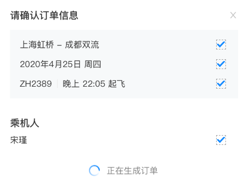

## 使用装饰者模式改善既有代码

### 装饰者
装饰者是一个用来改变函数行为的**包装器**，它可以在不更改函数原有代码的前提下，为函数增加其他功能。一个简单的例子是计算函数的执行时间：
````js
function add(a, b) {
  return a + b;
}

function calculateTimeDecorator(fn) {
  return (...args) => {
    const start = Date.now();
    const res = fn(...args);
    const end = Date.now();
    console.log(`函数 ${fn.name} 的执行时间为：${end - start}`);
    return res;
  }
}

// 使用
const sum1 = add(a, b);
const sum2 = calculateTimeDecorator(add)(a + b);

sum1 === sum2 // true
````
你看，在 JavaScript 中使用装饰者确实是一件非常容易的事儿，但我们平常几乎不会使用它。凑巧的是，我遇到了个这样的业务场景。

### 业务背景
机票预订 loading 是一个漫长的串行流程：校验表单、校验乘机人、下单、占座......但在用户看来，就只看到一个弹窗在不停的loading


正常预订流程的伪代码如下：
````js
async tapBookingButton() {
  await validateForm();
  await validatePassengers();
  await confrimOrder();
  await occupySeat();
  ...
}

````
非常流畅、简洁，但是！！！

在等待的过程中，用户可以点击右上角的关闭按钮，此时会弹出二次确认框，用于确认【继续预订】或者【结束预订】，这带来了额外的复杂度：
* 用户可以在任意时刻停止、继续或结束预订流程
* 在二次确认之前，需暂停后续流程
* 当用户选择继续预订的时候，不能重复已经执行过的步骤
* 结束预订时，如果已经创建订单，需要自动取消这个订单

### 解决问题
要实现业务需求，可以粗暴的将以上逻辑塞进每一个函数中，但经验告诉我，肯定有更好的方法，它就是装饰者。

为什么选择装饰者模式？

分析上面的流程可以发现，预订暂停及后续操作虽然会影响每一个函数的行为，但和函数代码本身并无交集，这正好符合前述对装饰者的定义。

现在一起来实现它：
````js
function waitSeconds(second) {
  return new Promise((resolve) => setTimeout(resolve, second * 1000))
}

function bookingDecoration(fn) {
  return async (...args) => {
    try {
      // 暂停
      if (this.booking.isPaused) {
        await waitSeconds(0.8); // 这里的时间可以自定义
        return bookingDecorator(fn)(...args);
      }
      if (this.booking.isAborted) {
        // 取消
        if (this.booking.canCancel) {
          await cancelOrder();
        }
        throw "下单流程被手动终止";
      }
      // 继续预订
      return fn.call(this, ...args);
    } catch (e) {
      // 抛出空异常，中断后续流程
      // 外部捕获异常时，对空异常不做处理
      throw null;
    }
  };
}

````

使用方式：
````js
async tapBookingButton() {
  try {
    await bookingDecoration(validateForm)();
    await bookingDecoration(validatePassengers)();
    await bookingDecoration(confrimOrder)();
    await bookingDecoration(occupySeat)();
    ...
  } catch(e) {
    if (!e) return;
    handleException(e);
  }
}
````
完。
