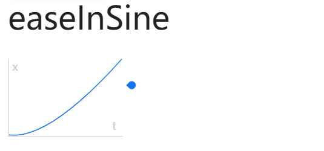

### 这个活动搞一个转盘抽奖吧，简单弄下就行

离下班还有半小时，产品发给我了一个小需求。

一看我就笑了——转盘抽奖，这还不容易？无非：
* 1. 请求数据；
* 2. 等待结果返回，计算转盘停止时的角度 x，开始旋转；
* 3. 等待旋转停止

关键代码：
````js
const angle = await fetchData()
const rotateElm = document.querySelect('.rotate-img')
rotateElm(elm, angle)

function rotateElm(elm, angle) {
  elm.style.transitionProperty = 'transform'
  elm.style.transitionDuration = '5s'
  elm.style.transitionTimingFunction = 'ease;
  elm.style.transform = 'rotate(' + 360 * 5 - angle + 'deg)'
}
````
简洁、快速的实现了需求，非常棒！

发布测试，下班干饭！

翌日。

### 能不能立马转起来？

每次点击都得停顿下才旋转，用户体验不好，能不能立马转起来？测试妹子如是说。

“你看xx、yy，别人家都这样啊！”我心里有点不爽。但，咱可不能说不行，尤其在妹子面前。

没问题的！

### 给飞驰的汽车换轮子
上面的方案，是等待异步结果返回了，才开始旋转，这是停顿的原因。解决思路也就明确了：
1. 开始旋转，同时发送请求；
2. 等待结果返回，设置停止角度；
3. 等待旋转停止。

显然，通过 CSS 已经无法满足需求，得祭出 JS 大法方可自由控制旋转动画。

#### 缓动函数
使用 JS 实现动画是一个精细活儿，还好大神们已经实现了常用的[缓动函数](https://easings.net/cn#)，respect！譬如下面这位，[详见](https://easings.net/cn#easeInSine):
````ts
function easeInQuad(x: number): number {
  return x * x;
}
````
用一张图来说时间 t 和 x 的关系：


横坐标是时间 t，纵坐标是 x，曲线便是 easeInQuad 的返回值。其中 x 的取值范围是[0,1]，easeInQuad 的结果范围也是[0,1]。

原料都准备好了，菜炒得好不好吃就看各家的水平了。

#### 使用缓动函数完成动画

动画是怎么动的？大白话就是不停的改变物体的状态（旋转角度、位置、大小等），它就动起来了。在 JS 的语境下，就得在每一帧（1000/60 ms）改一下元素的状态。那么如何得到元素在任意时刻的状态值(crrentV) 呢？

P.S. **以下内容讨论的是线性的简单动画，注意标题**

线性动画四要素：开始状态(starV)、结束状态(endV)、持续时间(duration)以及如何动(easeInQuad(x))。

转化成代码语言就是要：在 duration 毫秒内，动画初始值 startV 经过 easeInSine(x) 转换后，变成结束值 endV。所以，在某一帧 f 时：`x = f * 1000 / (duration * 60)`。

这一步貌似有点突然，怎么得出的，且听我慢慢道来。

为了获得平滑的动画效果，我们会使用`[requestAnimationFrame](https://developer.mozilla.org/zh-CN/docs/Web/API/Window/requestAnimationFrame)`来执行动画函数，回调函数执行次数通常是每秒60次，即 （1000/60）毫秒执行一次回调。

假设某个动画的持续时间是 5000ms，那么应该执行 300 次：5000/count = 1000/60 => count = 300。又因为上述 x 的取值范围为[0,1]，也就是说，x 从 0 开始，经过 300 次递增后变成了 1，那么每次递增的幅度为 1/300。任意一帧 f 对应的 x = f / 300，即 `x = f * 1000 / (duration * 60)`

有了上面的推论，就很容易得到某一帧 f 对应的状态 currentV：`crrentV = startV + (endV - startV) * easeInSine(x)`

由此，可以得到一个通用的缓动函数执行器：
````js

function tweenExcution ({
  startValue, 
  endValue, 
  duration,  
  infinite,
  easingFn, 
  stepCb
}) {
  const perUpdateDistance = 1000 / (duration * 60)
  const diffValue = endValue - startValue

  let position = 0
  let prevState = 0
  let state = 0
  let maxDiffState = 0
  let shouldStop = false

  function step () {
    if (shouldStop) return

    if (position < 1) { // 按 easingFn 进行运动
      position += perUpdateDistance
      prevState = state
      state = startValue + diffValue * easingFn(position)
      stepCb(state)
      rAF(step)
    } else if (infinite) {
      if (maxDiffState == 0) {
        maxDiffState = state - prevState
      }
      state += maxDiffState
            
      stepCb(state)
      rAF(step)
    }
  }

  step()

  return {
    stop() {
      shouldStop = true
    },
    getState() {
      return state
    }
  }
}

function rAF(cb) {
  requestAnimationFrame(cb)
}
````
剩下的工作就很简单了，代码[详见](https://github.com/CaptainLiao/notes/blob/master/blog/2021/9/test.html)。

完/

