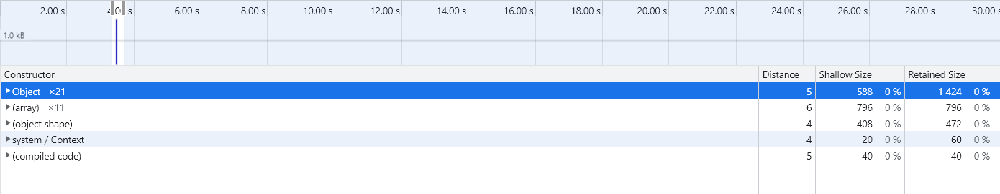
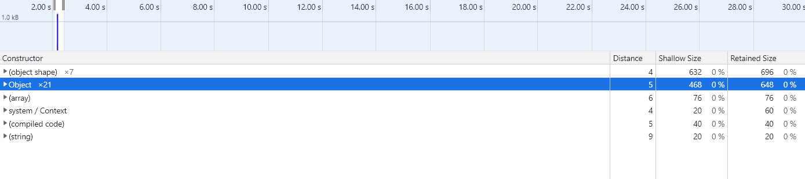
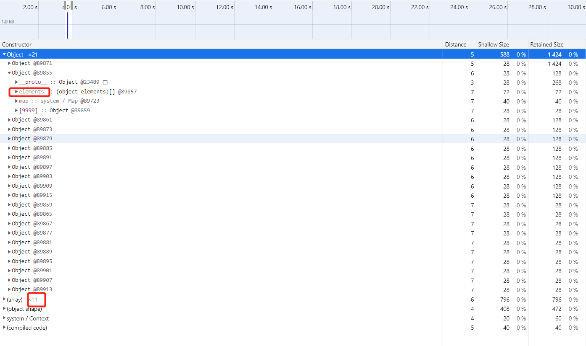

## 背景
同事开发一个表格，一次性渲染5w+条数据。但在渲染某些数据时，内存暴增，经排查，发现其数据用了数字`90`作为对象的key。

## 分析
我们猜测，当用数字作为对象的key时，数据将以数组的形式进行存储。由于其中拥有大量的节点（空节点也要占据内存），导致内存飙升。

使用*chrome浏览器无痕模式*进行验证，在控制台输入如下测试代码，观察内存变化：
````js
let a = {}
let indexValue = 200

for(var i = 0; i < 500; i++) {
    a[i] = {}
    for (var j = 0; j < 500; j++) {
        a[i][j] = {}
        a[i][j][indexValue] = {}
    }
}
````
通过不断改变`indexValue`的值，得到`indexValue`和内存占用的关系如下：
| indexValue | memory size(M) |
|------------|----------------|
|  9         | 50             |
|  90        | 171            |
|  200       | 336            |
|  500       | 786            |
|  600       | 936            |
|  1023      | 1572           |
|  1024      | 35             |
|  1028      | 35             |
|  9999      | 35             |

可以看到，随着`indexValue`的不断增加，内存也不断升高，直到`indexValue`值为1023时内存占用达到顶峰，随后立即断崖式下降。

v8 的官网文章[fast-properties](https://v8.dev/blog/fast-properties)也有提及。

## 结论
当我们使用对象存储数据时，不要用数字作用对象的key，以避免内存浪费。

## 更进一步
如上所述，使用超过`1023`的数字作为对象key，好像也可以呢。现在我们使用大数字`9999`和字符串`absdfsd`作为对象key，分别测量它们的内存占用情况：
````js
let a = {}

for(var i = 0; i < 10; i++) {
    a[i] = {9999: {}}
}
````
使用数字`9999`内存占用558 + 796 + 408 = 1762b：



````js
let a = {}

for(var i = 0; i < 10; i++) {
    a[i] = {absdfsd: {}}
}
````
使用字符串`absdfsd`内存占用 632 + 468 + 76 + 20 = 1196b：



显然，**字符串作为key更省内存**。原因是，使用数字作为对象key，数据内部会额外保存一个数组，如下图。随着循环次数的增加，字符串省内存的优势会更加明显。



PS. 再来看看**动态key**，使用如下测试代码，内存占用情况又如何呢：
````js
let a = {}

for(var i = 0; i < 5000; i++) {
    a[i] = {[9999 + i]: {}}
}
````
````js
let a = {}

for(var i = 0; i < 5000; i++) {
    a[i] = {['abcd' + i]: {}}
}
````
这里就不截图了，有兴趣的同学可以自己尝试下。直接给结果：`9999 + i => 798,232`，`abcd + i => 890,132`，可以看到，两者占用的内存差别较小，但数字key更省内存。

## 引用
* [fast-properties](https://v8.dev/blog/fast-properties)
* [How is data stored in V8 JS engine memory?](https://blog.dashlane.com/how-is-data-stored-in-v8-js-engine-memory/)
* [Retained Size in Chrome memory snapshot - what exactly is being retained?](https://stackoverflow.com/questions/62049063/retained-size-in-chrome-memory-snapshot-what-exactly-is-being-retained)

