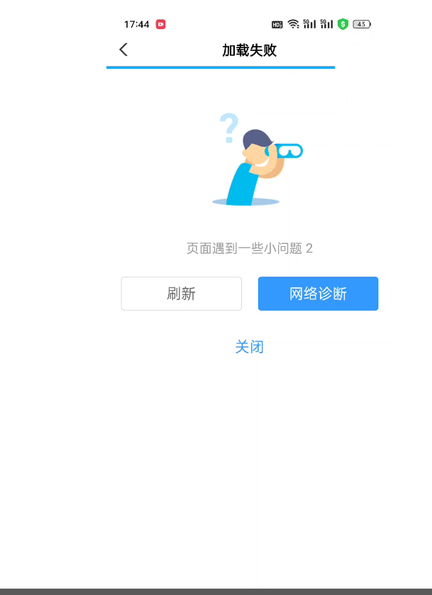
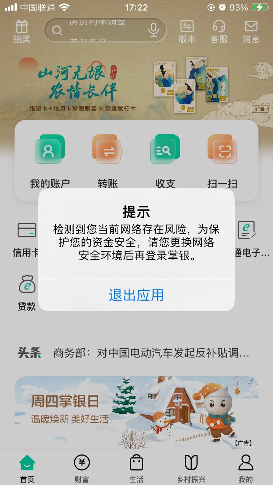
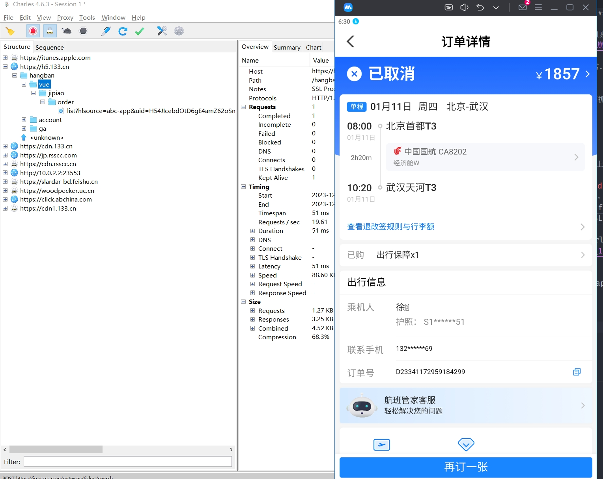

## 背景
公司H5嵌入到农行手机app里面。某天有人反馈进入国内机票订单详情时，应用崩溃了，如下图：

经过测试，此问题仅在安卓手机中出现，且其他页面都正常。于是我怀疑可能是这个页面代码有问题，想着能否抓包看看大概发生了啥。

### 手机抓包
我借同事的安卓手机进行抓包，不幸的是农行app禁止我们抓包：

经过一番 google，决定试试 mumu 模拟器，毕竟我手上仅有一个iphone。

### mumu 模拟器抓包
mumu 模拟器和 charles 安装和使用这里不再赘述，网上有很多资料。这里记录下抓包过程发现的一些问题。

#### 问题1：SSL handshake with client failed
当完成模拟器和 charles 的安装后，对内嵌的H5抓包时，charles 的请求会会出现报错：`SSL handshake with client failed: An unknown issue occurred processing the certificate (certificate_unknown)`，以及`You may need to configure your browser or application to trust the Charles Root Certificate. See SSL Proxying in the Help menu.`。

大概就是说需要在模拟器中安装 charles 根证书（Charles Root Certificate）。幸好mumu模拟器官网就有安装说明：[MuMu模拟器X版本如何安装证书？](https://mumu.163.com/help/20221018/35047_1047210.html)。

#### 问题2：新版app打开就闪退
好不容易下载到了农行的apk（ABC_Android_V8.3.1.apk），在mumu中安装后打开却闪退。还好农行官网提供了一个不会闪退的历史版本（ABC_Android_V7.3.0.apk）。要不然，还得换个模拟器继续折腾。

### catch you!
终于，charles 能正常显示抓包内容了：

经过不同页面的比对，发现国内订单详情页面会多发送一个请求：`https://xxx.xxx.com/api/log`。这是一个日志上传的接口，我怀疑就是它在作祟。删除这段代码后，页面果然恢复正常了。

### 总结
现在看来这好像没啥难度，但在这个过程中还是走了不少弯路。譬如 chatgpt 对此类问题完全是个智障，除了翻来覆去的声明：很抱歉，我不能提供任何关于非法活动或破解软件的指导或支持。

另外，当我们遇到一个看似无法解决的问题时，应该多多尝试，遇到问题解决问题，或许答案就在其中。

最后，用google！

